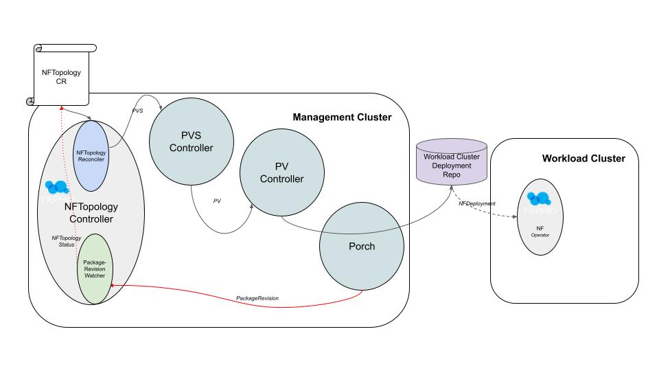
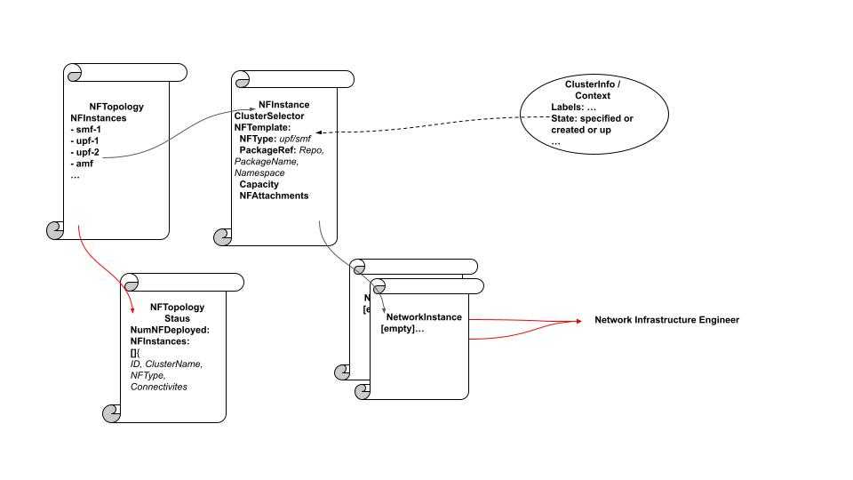

# NFTopology Controller
- Author: @s3wong
- Status: Work-in-Progress
- Approver: 

## Description
NFTopology controller (NTC) takes a network topology centric input and kickstarts the Nephio automation process via generating a PackageVariantSet (PVS) custom resource, and as the associated packages are being deployed, NTC continuously updates statuses to reflect state of deployment of these packages. Primarily, NTC serves as example application to utilize Nephio primitives for network function automations.



NTC contains two controllers, one watches the NFTopology custom resource, and reconcile that intent via constructing a number of PVSs; the other controller watches PackageRevision resources in the management cluster to determine what NF package has been deployed, and updates the NFTopology status accordingly.

## NFTopology CRD
This is the definition of the NFTopology custom resource:

```go
// NFInterface defines the specification of network attachment points of a NF
type NFInterface struct {
    // Name of the network attachment point
    Name string `json:"name" yaml:"name"`

    // NetworkInstanceRef is a reference to NetworkInstance. Two NF with attachment to
    // the same NetworkInstance is considered connected neighbors
    NetworkInstanceName string `json:"networkInstanceName" yaml:"networkInstanceName"`
}

// PackageRevisionReference is a temporary replica of PackageRevisionReference used for the
// ONE Summit
type PackageRevisionReference struct {
    // Namespace is the namespace for both the repository and package revision
    // +optional
    Namespace string `json:"namespace,omitempty"`

    // Repository is the name of the repository containing the package
    RepositoryName string `json:"repository"`

    // PackageName is the name of the package for the revision
    PackageName string `json:"packageName"`

    // Revision is the specific version number of the revision of the package
    Revision string `json:"revision"`
}
// NFTemplate defines the template for deployment of an instance of a NF
type NFTemplate struct {
    // NFType specifies the type of NF this template is specifying
    NFType string `json:"nfType" yaml:"nfType"`

    // NFPackageRef specifies the upstream package reference for this NFTemplate
    NFPackageRef PackageRevisionReference `json:"nfPackageRef" yaml:"nfPackageRef"`

    // Capacity specifies the NF capacity profile for this NF instance
    Capacity nephioreqv1alpha1.CapacitySpec `json:"capacity,omitempty" yaml:"capacity,omitempty"`

    // NFInterfaces
    NFInterfaces []NFInterface `json:"nfInterfaces,omitempty" yaml:"nfInterfaces,omitempty"`
}

type NFInstance struct {
    // Name specifies the name of this NFInstance
    Name string `json:"name" yaml:"name"`

    // ClusterSelector specifies the matching labels for the NF instance to be instantiated
    ClusterSelector metav1.LabelSelector `json:"clusterSelector" yaml:"clusterSelector"`

    // NFTemplate specifies the template of the NF to be deployed when a cluster matches
    // the selector above
    NFTemplate NFTemplate `json:"nfTemplate" yaml:"nfTemplate"`
}

type NFTopologySpec struct {
    NFInstances []NFInstance `json:"nfInstances" yaml:"nfInstances"`
}

// NFTopologyStatus defines the observed state of NFTopology
type NFTopologyStatus struct {
    // Number of NFs deployed for this topology
    NumNFDeployed int32 `json:"numNFDeployed,omitempty"`

    // Current service state of the NF.
    Conditions []nephiodeployv1alpha1.NFDeploymentConditionType `json:"conditions,omitempty"`

    // Detail on the deployed instances.
    NFInstances []NFDeployedInstance `json:"nfInstances,omitempty" yaml:"nfInstances,omitempty"`
}
```
where NFDeployedInstance is defined as:

```go
type NFConnectivity struct {
    // peer NF's Id (see NFInstance struct below)
    NeighborName string `json:"neighborName,omitempty" yaml:"neighborName,omitempty"`
}

// NFDeployedInstance defines an NF instance that is deployed
type NFDeployedInstance struct {
    // unique ID for this NF instance
    ID string `json:"id,omitempty" yaml:"id,omitempty"`
    // name of workload cluster where the NF instance is to be deployed
    ClusterName string `json:"clusterName,omitempty" yaml:"clusterName,omitempty"`
    // type of NF, example: amf, smf, upf
    NFType string `json:"nfType,omitempty" yaml:"nfType,omitempty"`
    // list of connected NF instances to this NF instance
    Connectivities []NFConnectivity `json:"connectivities,omitempty" yaml:"connectivities,omitempty"`
}
```

The concept behind the NFTopology custom resource is denoted by the following diagram:



Note that the NetworkInstance field is static, i.e., user defined a fixed NetworkInstance resource to be linked to a template, whereas the actual NF instance is dynamic --- that is, the actuation of the instance of the NF is based off of a cluster matching some labels, but the NetworkInstace this NF specification will be attaching to is statically configured. Note that each NFInstance would only create one instance per each cluster matching a label, and that the NFNetworkInstance does **NOT** define the network, it is merely
a placeholder to denote a connectivity between an instance's attachment point to another instance's attachment point

## NFTopology to PackageVariantSet CR Mapping
NTC kickstarts the hydration process via applying the **PackageVariantSet** (PVS) CR to management cluster. The following table denotes which fields from NFTopology (and its associated struct) will be used to populate the PVS CR:

| NFTopology or associated | PVS Spec field | 
|:------------------------ | :------------- |
| NFTopology.NFInstance.NFTemplate.PackageRevisionRef | Upstream (*Tag* is missing from PackageRevisionRef... Revision?) | 
| NFTopology.NFInstance.ClusterSelector | Targets[0].Repositories |
| {nf-deployment-name : *name of NFTopology CR* | Labels[] | 

The assumption here is that (at least a subset of) the ClusterSelector labels will be used to also label the repositories, i.e., target workload cluster with label `region == x; cluster-role == y` will also be part of the labels to use on a deployment repo of a target workload cluster.

NFTopology CR has capacity input which needs to be passed through PVS to the actual NF packages. This can be accomplished via the kpt provided function **search-replace** where the capacity input from NFTopology CR can be passed to the cloned NF package, which also contains capacity.yaml.

NTC will also need to associate all the to-be-fan'ed-out packages with this deployment. In PVS, this is allowed as a set of labels to be passed to PVS controller, which will then propagate those labels to PackageVariant (PV) CRs, and subsequently the PackageRevision (PR) CRs. NTC will then watch for all the PR resources created, and associated them with which NFTopology specification via these labels.

NTC also adds a label to each of the associated PVCs for connectivity association. This will lead to each resulting PackageRevision to also carry these labels.


## Tracking Packages
NTC will embed a label 'nf-deployment-name', which is set to NFToplogy CR's own name; PackageVariantSet and PackageVariant controllers will propagate this label to all the PackageRevision resources associated with the "fan-out"ed packages.

NTC watches over all PackageRevision resources in the management cluster, and maps the NFTopology intent to the number of deployed NF resources via tracking corresponding PackageRevision resources. As each PackageRevision resource gets to *PUBLISHED* state, NTC would update the **NFInstances** field of its status to reflect on deployed NF package.

NTC will also extract the number of pending conditions from each of the PR as a display to user(s) who want to continuously examine the lifecycle of the packages, and which conditions are gating a particular package from being deployed. NTC essentially tracks status of package deployment for all NF instances specified derived from the NFTopology intent; however, NTC does **NOT** track the progress of the deployment once the package is pushed to the workload cluster.

## Constructing NFInstances of NFTopology Status
NTC only tracks those NF instances that are successfully deployed, i.e., the corresponding cloned and hydrated / specialized package is merged to the **main** branch on the corresponding deployment repo for that target workload cluster. NTC would first create the initial *NFDeployTopology* CR when the first package merged, then update the CR as every subsequent package got merged.

As each NF package got merged, the existing NFDeployedInstance's Connectivities field would change. This relationship is keyed off of the NetworkInstance resource; NetworkInstance specifies for each cluster matching the input label, a corresponding NF specified by NFTemplate would be deployed. For each NFAttachment defined on this NFInstance, there is a NetworkInstance defined --- and for any other NFInstance that has NFAttachment
attached to this same network, it means the two NFInstances are connected. From this, NTC can construct the connectivities part of the NFDeployedInstance struct. The rest of the NFDeployedToplogy basically mapped one to one with different parts of NFTopology, as denoted by the following table:

| NFTopology | NFDeployedInstance | 
|:---------- | :----------------- |
| **self-generated** | *Id* |
| deployment repo | *ClusterName* |
| NFTemplate.NFType | *NFType* | 

## Reference
Package Variant Controller: [doc](https://github.com/GoogleContainerTools/kpt/blob/a58c5c080787de693382ffd6936b73e9aed116c8/docs/design-docs/08-package-variant.md)
